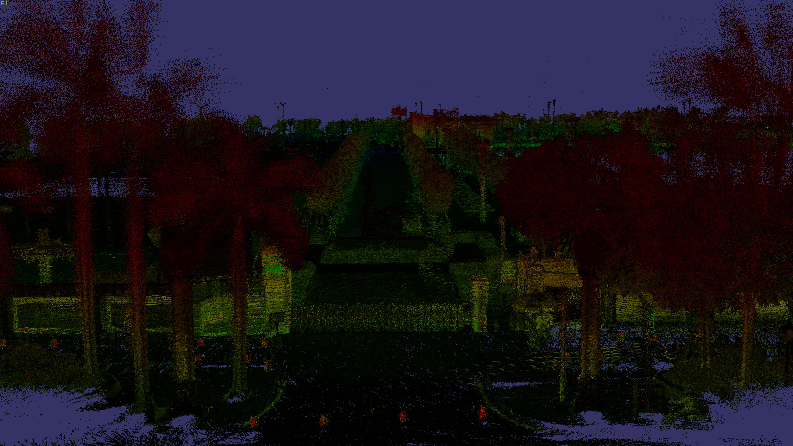

# lodToolkit
- level-of-details toolkit(LTK)

## App

### osgbTo3mx
- Convert *osgb* lod tree to Bentley ContextCapture *[3mx](https://docs.bentley.com/LiveContent/web/ContextCapture%20Help-v9/en/GUID-CED0ABE6-2EE3-458D-9810-D87EC3C521BD.html)* tree.

### pointcloudToLod
- Convert point cloud in *ply/las/laz/xyz* format to *osgb/[3mx](https://docs.bentley.com/LiveContent/web/ContextCapture%20Help-v9/en/GUID-CED0ABE6-2EE3-458D-9810-D87EC3C521BD.html)* lod tree, so that the point cloud could be loaded instantly.
- This program could handle extremely large point cloud as *ply/las/laz/xyz* file is streaming to the convertor.
> NOTE: Official 3mx does NOT support pointcloud, this project extended 3mx to make it happen. Please read the code for details. 

### meshToLod (WIP)
- Convert mesh in *obj* format to *osgb/[3mx](https://docs.bentley.com/LiveContent/web/ContextCapture%20Help-v9/en/GUID-CED0ABE6-2EE3-458D-9810-D87EC3C521BD.html)* lod tree, so that the mesh could be loaded instantly.
- This program only support *obj* format mesh with group info, each group will be a tile in the lod tree.

## Doc
- [How to use](./doc/howToUse.md)
- [How to build](./doc/howToBuild.md)

## Pre-build
- [Win64](https://github.com/ProjSEED/lodToolkit/releases/)

## Related project
- [osgPlugins-3mx](https://github.com/ProjSEED/osgPlugins-3mx): load *3mx/3mxb* format LOD model(support both mesh and pointcloud) files into OpenSceneGraph.
- [Unity-3mxb](https://github.com/ProjSEED/Unity-3mxb): load *3mx/3mxb* LOD model files into Unity.
- [MiaokitJS](https://github.com/YONGTOC/MiaokitJS): load *3mx/3mxb* LOD model files into Web browser.

## Thirdparty (source codes included for convenience):
- [LASzip](https://github.com/LASzip/LASzip)
- [openCTM-1.0.3](http://openctm.sourceforge.net/)
- [cJsonObject-1.2](https://github.com/Bwar/CJsonObject)
- PlyIO

